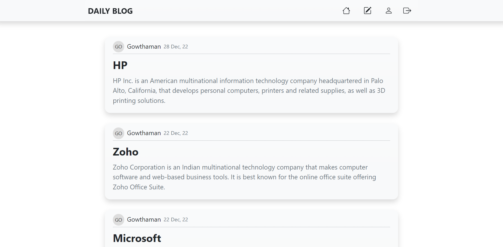
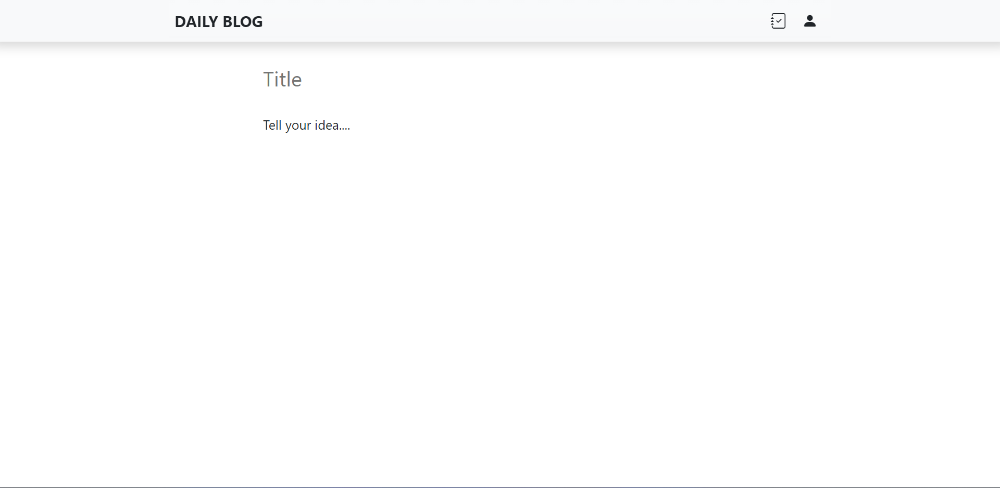
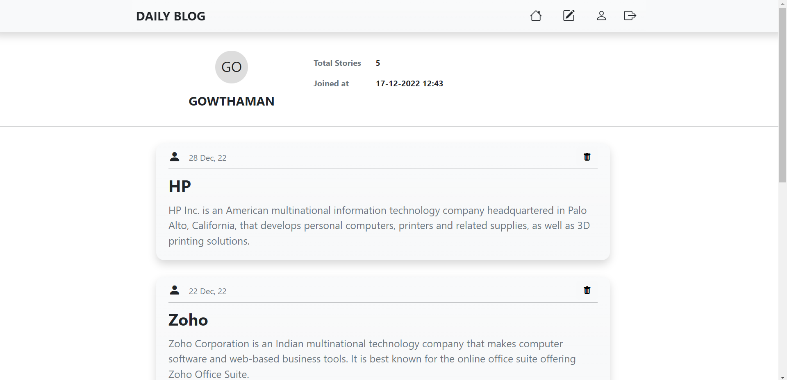
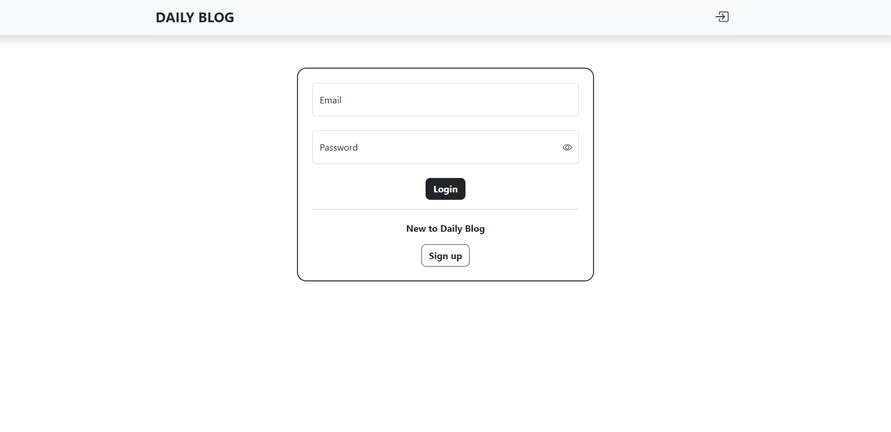

<!DOCTYPE html>
<html lang="en">
<head>
    <meta charset="UTF-8">
    <meta http-equiv="X-UA-Compatible" content="IE=edge">
    <meta name="viewport" content="width=device-width, initial-scale=1.0">
    <link href="https://cdn.jsdelivr.net/npm/bootstrap@5.3.0-alpha1/dist/css/bootstrap.min.css" rel="stylesheet" integrity="sha384-GLhlTQ8iRABdZLl6O3oVMWSktQOp6b7In1Zl3/Jr59b6EGGoI1aFkw7cmDA6j6gD" crossorigin="anonymous">
</head>
<body>
    
# ✍️ Daily Blog
#### 🚀 View at : https://dailyblog.pythonanywhere.com 
- 👋 Hi, Daily Blog is a web application project
- 🏬 Simple blogging website
- 💻 Developed using Flask and SQLite

    
    
    
    

</body>
</html>